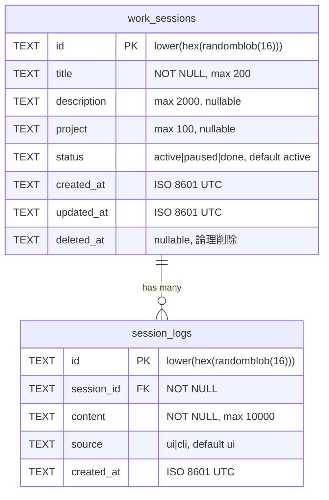

# feat: 作業セッション機能を追加

## Overview

複数PC・複数プロジェクトで並行作業する際のコンテキスト喪失問題を解決する。新概念 `work_session` + `session_log` を導入し、ダッシュボードでの俯瞰、CLIでのコンテキスト保存/復帰を実現する。

## Proposed Solution

### データモデル



### 設計判断（SpecFlow分析結果を反映）

| 項目 | 決定 | 理由 |
|------|------|------|
| ステータス遷移 | 全遷移許可（done→activeも可） | 個人ツールなので柔軟性優先 |
| paused時のログ追加 | 許可 | メモを残したい場面がある |
| done時のログ追加 | 不可（403） | 完了は完了 |
| session_logsのdeleted_at | なし（追記専用） | ログは履歴。編集/削除不要 |
| content上限 | 10,000文字 | Markdown文書として十分 |
| Markdownレンダリング | プレーンテキスト表示（MVP） | 外部ライブラリ追加を回避。後からmarked追加可 |
| ダッシュボード表示 | active + pausedをデフォルト | doneはフィルタで切替 |
| ログ表示順 | 古い順（時系列） | 作業の流れを追いやすい |
| ブラウザ戻るボタン | 非対応（MVP） | signal切替のみ。ルーター導入は後回し |
| CLI セッション特定 | セッション名で指定 | IDは覚えられない |
| projects API | work_sessionsのprojectもUNIONで統合 | サイドバーに全projectを表示 |
| session_logs.source | "ui" or "cli" を記録 | 将来の分析用。MVPでは表示には使わない |

## Implementation Phases

### Phase 1: バックエンドAPI

#### 1-1. D1マイグレーション

**`migrations/0002_create_work_sessions.sql`**

```sql
CREATE TABLE IF NOT EXISTS work_sessions (
    id TEXT PRIMARY KEY DEFAULT (lower(hex(randomblob(16)))),
    title TEXT NOT NULL CHECK(length(title) <= 200),
    description TEXT CHECK(length(description) <= 2000),
    project TEXT CHECK(length(project) <= 100),
    status TEXT NOT NULL DEFAULT 'active' CHECK(status IN ('active', 'paused', 'done')),
    created_at TEXT NOT NULL DEFAULT (strftime('%Y-%m-%dT%H:%M:%SZ', 'now')),
    updated_at TEXT NOT NULL DEFAULT (strftime('%Y-%m-%dT%H:%M:%SZ', 'now')),
    deleted_at TEXT
);

CREATE INDEX IF NOT EXISTS idx_work_sessions_status ON work_sessions(status);
CREATE INDEX IF NOT EXISTS idx_work_sessions_project ON work_sessions(project);
CREATE INDEX IF NOT EXISTS idx_work_sessions_deleted_at ON work_sessions(deleted_at);

CREATE TABLE IF NOT EXISTS session_logs (
    id TEXT PRIMARY KEY DEFAULT (lower(hex(randomblob(16)))),
    session_id TEXT NOT NULL REFERENCES work_sessions(id),
    content TEXT NOT NULL CHECK(length(content) <= 10000),
    source TEXT NOT NULL DEFAULT 'ui' CHECK(source IN ('ui', 'cli')),
    created_at TEXT NOT NULL DEFAULT (strftime('%Y-%m-%dT%H:%M:%SZ', 'now'))
);

CREATE INDEX IF NOT EXISTS idx_session_logs_session_id ON session_logs(session_id);
CREATE INDEX IF NOT EXISTS idx_session_logs_created_at ON session_logs(created_at);
```

#### 1-2. 型定義

**`src/lib/db.ts`** に追加:

```typescript
export interface WorkSessionRow {
  id: string;
  title: string;
  description: string | null;
  project: string | null;
  status: string;
  created_at: string;
  updated_at: string;
  deleted_at: string | null;
}

export interface SessionLogRow {
  id: string;
  session_id: string;
  content: string;
  source: string;
  created_at: string;
}
```

#### 1-3. Zodバリデーション

**`src/validators/session.ts`** （新規）

```typescript
// createSessionSchema: title必須, description/project/statusはoptional
// updateSessionSchema: createの.partial()
// listSessionsQuery: status, project, sort, order, limit, offset
// createSessionLogSchema: content必須, source optional (default "ui")
```

#### 1-4. APIルート

**`src/routes/sessions.ts`** （新規）

| Method | Path | 説明 |
|--------|------|------|
| GET | `/api/sessions` | 一覧（フィルタ: status, project, sort, order, limit, offset）|
| GET | `/api/sessions/:id` | 詳細 + 最新ログ3件 |
| POST | `/api/sessions` | 作成 |
| PATCH | `/api/sessions/:id` | 更新（title, description, project, status） |
| DELETE | `/api/sessions/:id` | 論理削除（子ログもカスケード論理削除…→ログは追記専用のため不要。セッション側のみdeleted_at設定） |
| GET | `/api/sessions/:id/logs` | ログ一覧（古い順、limit/offset） |
| POST | `/api/sessions/:id/logs` | ログ追加（status=doneなら403） |

**`src/index.ts`** に追加: `app.route("/api/sessions", sessions)`

#### 1-5. projects API拡張

**`src/routes/projects.ts`** を更新: `UNION` で `work_sessions.project` も含める

#### 1-6. テスト

**`test/sessions.test.ts`** （新規）

- セッションCRUD（作成、取得、更新、削除）
- ログ追加・一覧取得
- done状態でのログ追加拒否（403）
- 論理削除後のアクセス拒否（404）
- バリデーションエラー

**`test/helpers.ts`** 更新: 新マイグレーションSQL追加

### Phase 2: フロントエンド

#### 2-1. APIクライアント

**`frontend/src/lib/api.ts`** に追加:

```typescript
// 型: WorkSession, SessionLog, WorkSessionListResponse, etc.
// 関数: fetchSessions, fetchSession, createSession, updateSession,
//       deleteSession, fetchSessionLogs, createSessionLog
```

#### 2-2. ストア

**`frontend/src/stores/session-store.ts`** （新規）

```typescript
// signals: sessions, selectedSession, sessionLogs, loading, error, filter
// computed: activeSessions (active + paused), filteredSessions
// actions: loadSessions, loadSession, addSession, editSession,
//          removeSession, loadSessionLogs, addSessionLog
```

#### 2-3. ビュー切替

**`frontend/src/stores/app-store.ts`** （新規）

```typescript
// signal: currentView = signal<"tasks" | "sessions">("tasks")
// signal: selectedSessionId = signal<string | null>(null)
```

**`frontend/src/app.tsx`** 更新: ビュートグル追加

```
Layout
  |-- Header（ビュー切替タブ: Tasks / Sessions）
  |-- if currentView === "tasks":
  |     |-- ProjectSidebar + TodoForm + FilterBar + TodoList（既存）
  |-- if currentView === "sessions":
        |-- SessionDashboard（新規）
        |-- or SessionDetail（selectedSessionIdがある場合）
```

#### 2-4. コンポーネント

**`frontend/src/components/ViewToggle.tsx`** （新規）
- Tasks / Sessions のタブ切替UI

**`frontend/src/components/SessionDashboard.tsx`** （新規）
- アクティブ + 一時停止セッション一覧
- 各セッションカード: title, project, status, 最新ログプレビュー（先頭100文字）, 更新日時
- セッション作成フォーム（タイトル入力）
- 空状態: 「アクティブなセッションはありません」
- ステータスフィルタ（all / active / paused / done）

**`frontend/src/components/SessionCard.tsx`** （新規）
- セッション1件の表示カード
- クリックでSessionDetailへ遷移
- ステータスバッジ（active=green, paused=amber, done=gray）

**`frontend/src/components/SessionDetail.tsx`** （新規）
- セッション情報表示（title, project, status, 作成日）
- ステータス変更ボタン（active↔paused, →done）
- ログ一覧（古い順、タイムスタンプ付き）
- ログ追加フォーム（テキストエリア + 送信ボタン）
- 「戻る」ボタン → ダッシュボードへ

#### 2-5. スタイル

**`frontend/src/styles/global.css`** に追加:
- ビュートグルのスタイル
- セッションカードのグリッドレイアウト
- ステータスバッジ色（active=#22c55e, paused=#f59e0b, done=#6b7280）
- セッション詳細のログタイムライン表示
- ログ追加フォームのスタイル

### Phase 3: CLI連携（/taskflow context）

#### 3-1. skill更新

既存の `/taskflow` skill（SKILL.md）に `context` サブコマンドを追加:

- `/taskflow context save <session名> <内容>` → POST `/api/sessions/:id/logs`（source="cli"）
  - セッション名で検索（GET `/api/sessions?title=<name>&status=active`）
  - 一致するactiveセッションにログ追加
  - 該当なし → エラーメッセージ + activeセッション一覧を表示
- `/taskflow context load <session名>` → GET `/api/sessions/:id/logs?limit=5&order=desc`
  - 最新5件のログを取得して表示
  - セッション名省略 → activeセッション一覧を表示
- `/taskflow context list` → GET `/api/sessions?status=active`
  - アクティブセッション一覧を表示

## Acceptance Criteria

### Functional Requirements

- [x] セッションの作成・取得・更新・論理削除ができる
- [x] セッションにログエントリを追加できる（active/paused時のみ）
- [x] ダッシュボードでアクティブ+一時停止セッション一覧が表示される
- [x] セッション詳細でログの時系列表示と追加ができる
- [x] ステータス変更（active/paused/done）ができる
- [x] `/taskflow context save/load/list` でCLI操作ができる
- [x] 全入力がZodバリデーション済み
- [x] D1はプリペアドステートメントのみ使用

### Quality Gates

- [x] `npm test` 全テスト通過
- [x] `npm run typecheck` エラーなし
- [x] 既存のtodo機能に影響なし

## Dependencies & Risks

- **D1マイグレーション**: 本番適用時に `wrangler d1 migrations apply` が必要
- **フロントエンドビルドサイズ**: 新コンポーネント追加によるバンドルサイズ増（Preactなので影響小）
- **CLI skillの動作確認**: Claude Code上でのスキル実行テストが必要

## References

- Brainstorm: `docs/brainstorms/2026-02-27-work-sessions-brainstorm.md`
- 既存ルートパターン: `src/routes/todos.ts`
- 既存バリデーション: `src/validators/todo.ts`
- 既存ストア: `frontend/src/stores/todo-store.ts`
- 既存マイグレーション: `migrations/0001_create_todos.sql`
- Preact Signal使い分け: `docs/solutions/ui-bugs/preact-signal-misuse-and-code-review-fixes.md`
