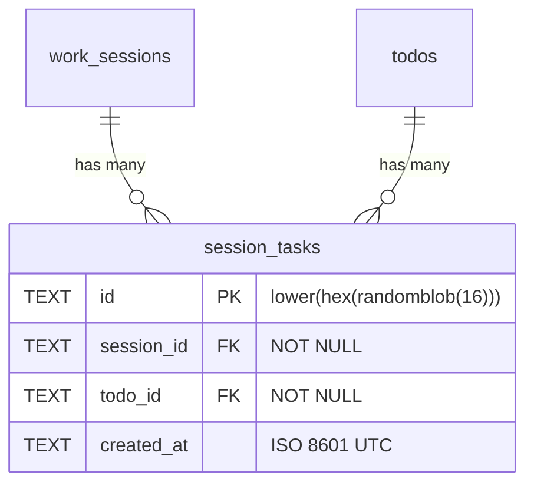

# feat: セッションとタスクの関連付け

## Overview

`session_tasks` 中間テーブルで work_sessions と todos の多対多関係を実現。セッション詳細から関連タスクを表示・操作し、タスク側からも関連セッションを参照できる。ダッシュボードではセッションごとのタスク進捗を俯瞰できる。

## Proposed Solution

### データモデル



### 設計判断（SpecFlow分析結果を反映）

| 項目 | 決定 | 理由 |
|------|------|------|
| 関係モデル | 多対多（中間テーブル） | 1タスクを複数セッションで進めるケースがある |
| pausedセッションへのリンク | 許可 | ログ追加と同じルール（doneのみ禁止） |
| doneセッションでのアンリンク | 許可 | データ修正の位置づけ |
| 重複リンク時 | 409 Conflict | 冪等より明示的エラーを選択 |
| アンリンク方式 | 物理DELETE | 中間テーブルに論理削除は過剰 |
| タスク一覧のセッション情報 | `linked_session_count` のみ | レスポンスサイズ抑制。詳細は個別取得時 |
| 検索対象 | `deleted_at IS NULL` の全タスク | completed含む。削除済みのみ除外 |
| セッション完了時の未完了タスク | そのまま完了許可 | 個人ツールなので警告不要 |
| セッション詳細の linked_tasks | 全件返す | 操作に必要 |
| タスク一覧→セッション遷移 | MVP非対応 | ビュー切替で対応。ルーター導入は後回し |
| リンク済みタスクの検索表示 | 「リンク済み」ラベル付きで表示 | 重複リンク防止 |
| インライン検索 | 300msデバウンス、最小1文字 | UXバランス |

## Implementation Phases

### Phase 1: バックエンドAPI

#### 1-1. D1マイグレーション

**`migrations/0003_create_session_tasks.sql`**

```sql
CREATE TABLE IF NOT EXISTS session_tasks (
    id TEXT PRIMARY KEY DEFAULT (lower(hex(randomblob(16)))),
    session_id TEXT NOT NULL REFERENCES work_sessions(id),
    todo_id TEXT NOT NULL REFERENCES todos(id),
    created_at TEXT NOT NULL DEFAULT (strftime('%Y-%m-%dT%H:%M:%SZ', 'now')),
    UNIQUE(session_id, todo_id)
);

CREATE INDEX IF NOT EXISTS idx_session_tasks_session_id ON session_tasks(session_id);
CREATE INDEX IF NOT EXISTS idx_session_tasks_todo_id ON session_tasks(todo_id);
```

#### 1-2. 型定義

**`src/lib/db.ts`** に追加:

```typescript
export interface SessionTaskRow {
  id: string;
  session_id: string;
  todo_id: string;
  created_at: string;
}
```

#### 1-3. Zodバリデーション

**`src/validators/session.ts`** に追加:

```typescript
export const linkSessionTaskSchema = z.object({
  todo_id: z.string().min(1),
});
```

#### 1-4. APIルート

**`src/routes/sessions.ts`** に追加:

| Method | Path | 説明 |
|--------|------|------|
| GET | `/api/sessions/:id/tasks` | リンク済みタスク一覧（todosをJOIN） |
| POST | `/api/sessions/:id/tasks` | タスク紐付け（status=doneなら403、重複なら409） |
| DELETE | `/api/sessions/:id/tasks/:todoId` | タスク紐付け解除（物理DELETE、done時も許可） |

**`src/routes/todos.ts`** に追加:

| Method | Path | 説明 |
|--------|------|------|
| GET | `/api/todos/:id/sessions` | タスクに紐付くセッション一覧 |

**既存エンドポイント更新:**

- `GET /api/sessions/:id` → レスポンスに `linked_tasks: TodoRow[]` を追加（2クエリ+マージパターン）
- `GET /api/sessions` → レスポンスに `task_total`, `task_completed` を追加（LEFT JOINサブクエリ）

```sql
-- セッション一覧の進捗付きクエリ
SELECT ws.*,
  COALESCE(st.total, 0) as task_total,
  COALESCE(st.completed, 0) as task_completed
FROM work_sessions ws
LEFT JOIN (
  SELECT session_id,
    COUNT(*) as total,
    SUM(CASE WHEN t.status = 'completed' THEN 1 ELSE 0 END) as completed
  FROM session_tasks st
  JOIN todos t ON st.todo_id = t.id AND t.deleted_at IS NULL
  GROUP BY session_id
) st ON ws.id = st.session_id
WHERE ws.deleted_at IS NULL
```

#### 1-5. テスト

**`test/sessions.test.ts`** に追加:

- タスクリンク成功（active/pausedセッション）
- タスクリンク失敗（doneセッション → 403）
- タスクリンク失敗（削除済みセッション → 404）
- タスクリンク失敗（存在しないタスク → 404）
- タスクリンク失敗（削除済みタスク → 404）
- 重複リンク → 409
- アンリンク成功
- アンリンク（存在しないリンク → 404）
- セッション詳細に `linked_tasks` 含む
- セッション一覧に `task_total`, `task_completed` 含む
- タスクの関連セッション一覧取得

**`test/helpers.ts`** 更新: `session_tasks` テーブルSQL追加

### Phase 2: フロントエンド

#### 2-1. APIクライアント

**`frontend/src/lib/api.ts`** に追加:

```typescript
// WorkSession 型を拡張
export interface WorkSession {
  // ... 既存フィールド
  task_total: number;
  task_completed: number;
  linked_tasks?: Todo[];  // 詳細取得時のみ
}

// 新規関数
export async function fetchSessionTasks(sessionId: string): Promise<{ tasks: Todo[] }>
export async function linkSessionTask(sessionId: string, todoId: string): Promise<{ session_task: SessionTask }>
export async function unlinkSessionTask(sessionId: string, todoId: string): Promise<void>
export async function fetchTodoSessions(todoId: string): Promise<{ sessions: WorkSession[] }>
```

#### 2-2. ストア更新

**`frontend/src/stores/session-store.ts`** に追加:

```typescript
export const linkedTasks = signal<Todo[]>([]);

export async function loadLinkedTasks(sessionId: string) { ... }
export async function linkTask(sessionId: string, todoId: string) { ... }
export async function unlinkTask(sessionId: string, todoId: string) { ... }
```

#### 2-3. SessionDetail 更新

**`frontend/src/components/SessionDetail.tsx`** に追加:

- ログセクションの上に「関連タスク」セクション追加
- リンク済みタスク一覧（チェックボックス + アンリンクボタン）
- インライン検索UI（テキスト入力→300msデバウンス→候補表示→選択でリンク）
- リンク済みタスクは「リンク済み」ラベル表示
- doneセッションでは検索UIを非表示（アンリンクは可能）

#### 2-4. SessionCard 更新

**`frontend/src/components/SessionCard.tsx`** に追加:

- タスク進捗表示: `3/5タスク完了`（task_total > 0 の場合のみ表示）

#### 2-5. TodoItem 更新

**`frontend/src/components/TodoItem.tsx`** に追加:

- todo-metaエリアにセッション名表示（タスク詳細取得時の `linked_sessions` から）
- ※ MVP: タスク一覧では表示しない。個別取得時のみ。

→ **MVPでは TodoItem のセッション表示は後回し**。セッション→タスク方向のみ先に実装。

#### 2-6. スタイル

**`frontend/src/styles/global.css`** に追加:

- タスクリンクセクションのスタイル
- インライン検索（入力フィールド + ドロップダウン候補リスト）
- リンク済みタスクリストのスタイル
- 進捗バッジのスタイル

### Phase 3: CLI連携

**`~/.agents/skills/taskflow/SKILL.md`** に追加:

- `/taskflow session link <セッション名> <タスクタイトル>` → タイトル部分一致で検索、POST
- `/taskflow session unlink <セッション名> <タスクタイトル>` → DELETE
- 複数マッチ時はエラー + 候補一覧表示

## Acceptance Criteria

### Functional Requirements

- [x] セッション詳細からインライン検索でタスクを紐付けできる
- [x] セッション詳細でリンク済みタスク一覧が表示される
- [x] リンク済みタスクのステータスをチェックボックスで変更できる
- [x] タスクの紐付け解除ができる
- [x] doneセッションへのリンク追加は禁止（403）
- [x] ダッシュボードのセッションカードにタスク進捗が表示される
- [x] CLIでタスクのリンク/アンリンクができる
- [x] 全入力がZodバリデーション済み
- [x] D1はプリペアドステートメントのみ使用

### Quality Gates

- [x] `npm test` 全テスト通過
- [x] `npm run typecheck` エラーなし
- [x] `cd frontend && npm run build` エラーなし
- [x] 既存のtodo/session機能に影響なし

## Dependencies & Risks

- セッション一覧の進捗付きクエリ: LEFT JOIN + サブクエリのパフォーマンス（データ量が少ない個人ツールなので問題なし）
- D1のFOREIGN KEY制約が無効な場合: アプリケーション層で存在チェック必須（既存パターンと同じ）
- インライン検索のUX: デバウンスとキーボードナビゲーションの実装

## References

- ブレインストーム: `docs/brainstorms/2026-02-28-session-task-linking-brainstorm.md`
- 既存セッションAPI: `src/routes/sessions.ts`
- 既存タスクAPI: `src/routes/todos.ts`
- 既存マイグレーション: `migrations/0002_create_work_sessions.sql`
- Preact Signal教訓: `docs/solutions/ui-bugs/preact-signal-misuse-and-code-review-fixes.md`
- セッション機能プラン: `docs/plans/2026-02-27-feat-work-sessions-plan.md`
