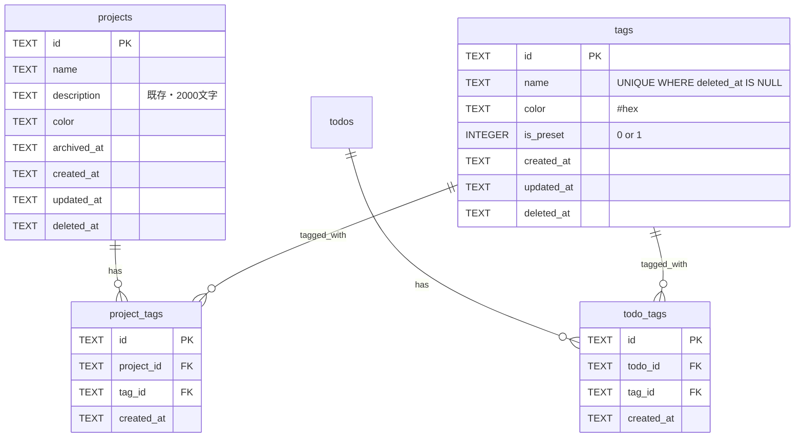

# feat: プロジェクト概要表示 & タグシステム

## Overview

2つの機能を追加する:

1. **プロジェクトdescription表示・編集** — バックエンド実装済み。フロントエンドUI追加のみ
2. **タグシステム** — プロジェクト・タスク両方にタグ付け可能。マトリクスビューのプロジェクトタグでフィルタリング

## 設計決定事項（確定済み）

| 項目 | 決定 |
|------|------|
| タグ名前空間 | 共有（プロジェクト・タスク同一プール） |
| MatrixHeaderフィルタ対象 | プロジェクトタグのみ |
| フィルタ選択方式 | シングルセレクト（「全て」+ 各タグ） |
| description編集UI | インライン拡張（既存パターン踏襲） |
| タグ形式 | ハイブリッド（プリセット4つ + カスタム自由入力） |
| プリセットタグ | 仕事 / プライベート / 学習 / 副業 |
| description表示位置 | ProjectCell内、名前の直下に小さく |
| タグ削除時 | 論理削除 + junction物理削除 + 確認ダイアログ |
| タグ編集 | 名前・色の変更可能 |

## ERD



## Implementation Phases

### Phase 1: プロジェクトdescription表示・編集（バックエンド変更なし）

バックエンド（DB/API/バリデータ/型）は全て実装済み。フロントエンドのみ。

#### 1-1. ProjectCell にdescription表示を追加

**ファイル**: `frontend/src/components/ProjectCell.tsx`

- Props に `projectDescription: string | null` 追加
- プロジェクト名の下に1-2行で表示（`text-overflow: ellipsis`、最大2行）
- description が null/空なら表示しない

**ファイル**: `frontend/src/components/MatrixRow.tsx`

- Props に `projectDescription` 追加、ProjectCell へパススルー

#### 1-2. ProjectCell の編集をインライン拡張

**ファイル**: `frontend/src/components/ProjectCell.tsx`

- 既存の「編集」（リネームのみ）を拡張
- `renaming` signal → `editing` signal にリネーム
- 編集モード: name input + description textarea（2フィールド縦並び）
- Enter（name input）/ Ctrl+Enter（textarea）で保存、Escapeでキャンセル
- `editProject(id, { name, description })` で保存（ストア関数は既存のまま）

#### 1-3. プロジェクト作成フォームにdescription追加

**ファイル**: `frontend/src/components/MatrixHeader.tsx`

- 既存のインラインフォーム（name入力のみ）にdescription textarea追加
- description は任意入力（名前のみでも作成可能）
- `addProject({ name, description })` で保存

#### 受入基準

- [ ] ProjectCellにdescription表示（名前の下、小さいテキスト、最大2行truncate）
- [ ] プロジェクト編集でname + description変更可能
- [ ] プロジェクト作成時にdescriptionも入力可能
- [ ] description空/nullなら表示領域は出ない

---

### Phase 2: タグシステム — バックエンド

#### 2-1. DBマイグレーション

**ファイル**: `migrations/0005_create_tags.sql`

```sql
-- tags テーブル
CREATE TABLE IF NOT EXISTS tags (
    id TEXT PRIMARY KEY DEFAULT (lower(hex(randomblob(16)))),
    name TEXT NOT NULL CHECK(length(name) <= 50),
    color TEXT CHECK(length(color) <= 7),
    is_preset INTEGER NOT NULL DEFAULT 0,
    created_at TEXT NOT NULL DEFAULT (strftime('%Y-%m-%dT%H:%M:%SZ', 'now')),
    updated_at TEXT NOT NULL DEFAULT (strftime('%Y-%m-%dT%H:%M:%SZ', 'now')),
    deleted_at TEXT
);
CREATE UNIQUE INDEX IF NOT EXISTS idx_tags_name ON tags(name) WHERE deleted_at IS NULL;

-- プリセットタグ
INSERT INTO tags (name, color, is_preset) VALUES ('仕事', '#3B82F6', 1);
INSERT INTO tags (name, color, is_preset) VALUES ('プライベート', '#10B981', 1);
INSERT INTO tags (name, color, is_preset) VALUES ('学習', '#F59E0B', 1);
INSERT INTO tags (name, color, is_preset) VALUES ('副業', '#8B5CF6', 1);

-- project_tags 中間テーブル
CREATE TABLE IF NOT EXISTS project_tags (
    id TEXT PRIMARY KEY DEFAULT (lower(hex(randomblob(16)))),
    project_id TEXT NOT NULL REFERENCES projects(id),
    tag_id TEXT NOT NULL REFERENCES tags(id),
    created_at TEXT NOT NULL DEFAULT (strftime('%Y-%m-%dT%H:%M:%SZ', 'now')),
    UNIQUE(project_id, tag_id)
);
CREATE INDEX IF NOT EXISTS idx_project_tags_project ON project_tags(project_id);
CREATE INDEX IF NOT EXISTS idx_project_tags_tag ON project_tags(tag_id);

-- todo_tags 中間テーブル
CREATE TABLE IF NOT EXISTS todo_tags (
    id TEXT PRIMARY KEY DEFAULT (lower(hex(randomblob(16)))),
    todo_id TEXT NOT NULL REFERENCES todos(id),
    tag_id TEXT NOT NULL REFERENCES tags(id),
    created_at TEXT NOT NULL DEFAULT (strftime('%Y-%m-%dT%H:%M:%SZ', 'now')),
    UNIQUE(todo_id, tag_id)
);
CREATE INDEX IF NOT EXISTS idx_todo_tags_todo ON todo_tags(todo_id);
CREATE INDEX IF NOT EXISTS idx_todo_tags_tag ON todo_tags(tag_id);
```

#### 2-2. DB型定義

**ファイル**: `src/lib/db.ts`

```typescript
export interface TagRow {
  id: string;
  name: string;
  color: string | null;
  is_preset: number; // 0 or 1
  created_at: string;
  updated_at: string;
  deleted_at: string | null;
}

export interface ProjectTagRow {
  id: string;
  project_id: string;
  tag_id: string;
  created_at: string;
}

export interface TodoTagRow {
  id: string;
  todo_id: string;
  tag_id: string;
  created_at: string;
}

// ユーティリティ関数追加
export async function tagExists(db: D1Database, tagId: string): Promise<boolean> {
  const row = await db.prepare(
    "SELECT 1 FROM tags WHERE id = ? AND deleted_at IS NULL"
  ).bind(tagId).first();
  return row !== null;
}
```

#### 2-3. バリデータ

**ファイル**: `src/validators/tag.ts`（新規）

```typescript
export const createTagSchema = z.object({
  name: z.string().min(1).max(50).trim(),
  color: z.string().regex(/^#[0-9a-fA-F]{6}$/).optional(),
});
export const updateTagSchema = createTagSchema.partial();
export const listTagsQuery = z.object({
  include_deleted: z.enum(["true", "false"]).optional(),
});
```

#### 2-4. タグAPIルート

**ファイル**: `src/routes/tags.ts`（新規）

| メソッド | パス | 説明 |
|----------|------|------|
| GET | `/api/tags` | タグ一覧（deleted_at IS NULL） |
| POST | `/api/tags` | タグ作成 |
| PATCH | `/api/tags/:id` | タグ更新（name/color） |
| DELETE | `/api/tags/:id` | タグ論理削除 + junction物理削除 |

**ファイル**: `src/index.ts`

- `import tags from "./routes/tags"` + `app.route("/api/tags", tags)` 追加

#### 2-5. プロジェクト・タスクのタグ紐付けAPI

既存ルートに追加:

**ファイル**: `src/routes/projects.ts`

| メソッド | パス | 説明 |
|----------|------|------|
| GET | `/api/projects/:id/tags` | プロジェクトのタグ一覧 |
| POST | `/api/projects/:id/tags` | タグ紐付け `{ tag_id }` |
| DELETE | `/api/projects/:id/tags/:tagId` | タグ紐付け解除（物理削除） |

**ファイル**: `src/routes/todos.ts`

| メソッド | パス | 説明 |
|----------|------|------|
| GET | `/api/todos/:id/tags` | タスクのタグ一覧 |
| POST | `/api/todos/:id/tags` | タグ紐付け `{ tag_id }` |
| DELETE | `/api/todos/:id/tags/:tagId` | タグ紐付け解除（物理削除） |

#### 2-6. プロジェクト一覧APIでタグ情報を含める

**ファイル**: `src/routes/projects.ts` — `GET /api/projects`

- 既存クエリにGROUP_CONCATでタグ情報を埋め込み:

```sql
SELECT p.*,
  GROUP_CONCAT(DISTINCT t.id || ':' || t.name || ':' || COALESCE(t.color, '') || ':' || t.is_preset) as tag_info
FROM projects p
LEFT JOIN project_tags pt ON pt.project_id = p.id
LEFT JOIN tags t ON t.id = pt.tag_id AND t.deleted_at IS NULL
WHERE p.deleted_at IS NULL
GROUP BY p.id
```

- レスポンスに `tags: Tag[]` を含める（tag_info文字列をパースして配列に変換）

#### 2-7. テスト

**ファイル**: `test/tags.test.ts`（新規）

- タグCRUD、紐付け/解除、論理削除時のcascade、プリセットタグ確認
- 既存テストスキーマに tags/project_tags/todo_tags テーブル追加

#### 受入基準

- [ ] `GET /api/tags` でプリセット4タグ含む全タグ返却
- [ ] タグCRUD動作（作成/更新/削除）
- [ ] タグ削除時にproject_tags/todo_tagsの関連レコード物理削除
- [ ] プロジェクト一覧にタグ情報が含まれる
- [ ] FK存在チェック（tagExists）がCREATE/UPDATEで動作
- [ ] 重複タグ名の作成が防止される
- [ ] Vitestテスト合格

---

### Phase 3: タグシステム — フロントエンド

#### 3-1. API型・関数追加

**ファイル**: `frontend/src/lib/api.ts`

```typescript
export interface Tag {
  id: string;
  name: string;
  color: string | null;
  is_preset: boolean;
  created_at: string;
  updated_at: string;
}

// Project型にtags追加
export interface Project {
  // ...既存フィールド
  tags: Tag[];
}

// CRUD関数: fetchTags, createTag, updateTag, deleteTag
// 紐付け: linkProjectTag, unlinkProjectTag, linkTodoTag, unlinkTodoTag
```

#### 3-2. タグストア

**ファイル**: `frontend/src/stores/tag-store.ts`（新規）

```typescript
// モジュールレベル signal/computed
export const tags = signal<Tag[]>([]);
export const loading = signal(false);
export const error = signal<string | null>(null);

// フィルタリング用
export const selectedTagId = signal<string | null>(null); // null = "全て"

// アクション
export async function loadTags() { ... }
export async function addTag(data: CreateTagInput) { ... }
export async function editTag(id: string, data: UpdateTagInput) { ... }
export async function removeTag(id: string) { ... }

// プロジェクト・タスクタグ紐付け
export async function linkProjectTag(projectId: string, tagId: string) { ... }
export async function unlinkProjectTag(projectId: string, tagId: string) { ... }
export async function linkTodoTag(todoId: string, tagId: string) { ... }
export async function unlinkTodoTag(todoId: string, tagId: string) { ... }
```

#### 3-3. project-storeのフィルタ拡張

**ファイル**: `frontend/src/stores/project-store.ts`

- `visibleProjects` computed に `selectedTagId` フィルタ追加:

```typescript
export const visibleProjects = computed(() => {
  let filtered = projects.value;
  // アーカイブフィルタ（既存）
  if (!showArchived.value) {
    filtered = filtered.filter((p) => !p.archived_at);
  }
  // タグフィルタ（新規）
  const tagId = selectedTagId.value;
  if (tagId) {
    filtered = filtered.filter((p) =>
      p.tags?.some((t) => t.id === tagId)
    );
  }
  return filtered;
});
```

#### 3-4. MatrixHeader にタグフィルタUI追加

**ファイル**: `frontend/src/components/MatrixHeader.tsx`

- タグチップ行を追加（ツールバーの下、またはツールバー内）
- 「全て」チップ + 各タグチップ（プリセット優先、その後カスタムをアルファベット順）
- チップクリックで `selectedTagId.value` をセット（シングルセレクト）
- 選択中のチップはアクティブスタイル（背景色 = タグ色）

```
[+ プロジェクト追加]  [全て] [■仕事] [■プライベート] [■学習] [■副業]  [□ アーカイブ表示]
```

#### 3-5. ProjectCell にタグ表示・割当UI追加

**ファイル**: `frontend/src/components/ProjectCell.tsx`

- description の下にタグチップを小さく表示（色ドット + 名前、compact）
- 「...」メニューに「タグ編集」追加
- タグ編集: ドロップダウンで既存タグから選択 + 新規タグ作成オプション
- タグ付け/外しは `linkProjectTag` / `unlinkProjectTag` ストア関数経由

#### 3-6. タスクへのタグ付けUI

**ファイル**: `frontend/src/components/TasksCell.tsx` or `MiniTodoItem`

- MiniTodoItem は狭いため、タグはホバー時のツールチップまたは展開時のみ表示
- タスク編集時にタグ選択UI追加

#### 3-7. app初期化でタグ読み込み

**ファイル**: `frontend/src/components/MatrixView.tsx`

- `useEffect` 内の初期化に `loadTags()` 追加（既存の `loadProjects()`, `loadTodos()` と並列）

#### 受入基準

- [ ] MatrixHeaderにタグチップ行表示
- [ ] タグチップクリックでプロジェクト行がフィルタされる
- [ ] 「全て」で全プロジェクト表示に戻る
- [ ] ProjectCellにタグ表示
- [ ] プロジェクトへのタグ付け・外しが可能
- [ ] タスクへのタグ付け・外しが可能
- [ ] カスタムタグの作成が可能（インライン）
- [ ] `showArchived` フィルタとタグフィルタが共存

---

## ファイル変更サマリー

### 新規ファイル
| ファイル | 説明 |
|----------|------|
| `migrations/0005_create_tags.sql` | tags, project_tags, todo_tags テーブル + プリセットデータ |
| `src/routes/tags.ts` | タグCRUD APIルート |
| `src/validators/tag.ts` | Zodバリデーションスキーマ |
| `frontend/src/stores/tag-store.ts` | タグSignalストア |
| `test/tags.test.ts` | タグAPIテスト |

### 変更ファイル
| ファイル | 変更内容 |
|----------|----------|
| `src/lib/db.ts` | TagRow, ProjectTagRow, TodoTagRow 型 + tagExists() |
| `src/index.ts` | タグルート登録 |
| `src/routes/projects.ts` | タグ紐付けAPI + 一覧にタグ情報埋込 |
| `src/routes/todos.ts` | タグ紐付けAPI |
| `frontend/src/lib/api.ts` | Tag型 + CRUD関数 + 紐付け関数 |
| `frontend/src/stores/project-store.ts` | visibleProjects にタグフィルタ追加 |
| `frontend/src/components/ProjectCell.tsx` | description表示 + タグ表示 + 編集UI拡張 |
| `frontend/src/components/MatrixRow.tsx` | Props拡張（description/tagsパススルー） |
| `frontend/src/components/MatrixHeader.tsx` | タグフィルタチップ行 + 作成フォームdescription追加 |
| `frontend/src/components/MatrixView.tsx` | loadTags()初期化追加 |
| `frontend/src/components/TasksCell.tsx` | タスクタグ表示・編集UI |
| `test/helpers/` | テストスキーマにtags関連テーブル追加 |

## 注意事項（docs/solutionsからの学習）

- コンポーネント内は `useSignal()` / `useComputed()` を使用（`signal()` / `computed()` はメモリリーク）
- コンポーネントから `api.*` 直接呼び出し禁止（必ずストア経由）
- D1のFK制約に依存しない（`tagExists()` でアプリ層チェック）
- INSERT は `RETURNING *` で1クエリに
- API型は `Pick` + `Partial<Pick>` で厳密に定義

## References

- ブレインストーム: `docs/brainstorms/2026-03-02-project-description-and-tags-brainstorm.md`
- 既存パターン参考: `src/routes/projects.ts`, `src/routes/sessions.ts`
- Signals学習: `docs/solutions/logic-errors/preact-signals-store-architecture-code-review-findings.md`
