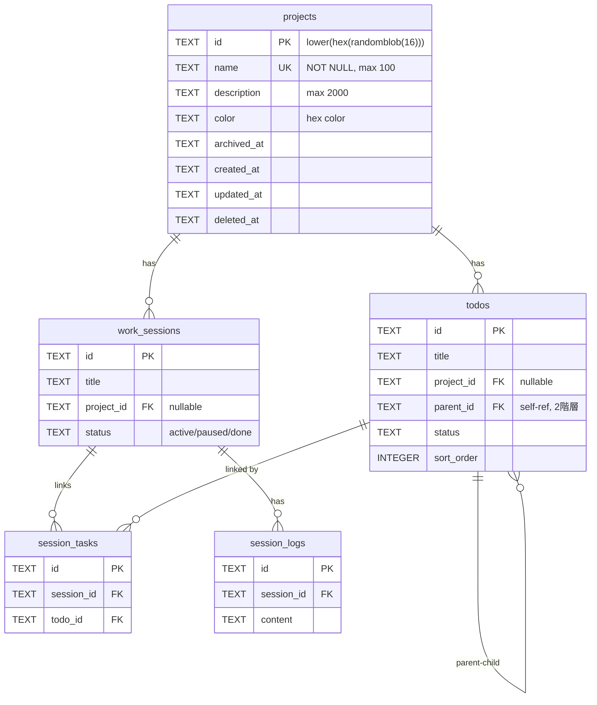

# feat: 統合マトリクスビュー

## Overview

タスク・セッション・プロジェクトを1つのマトリクスビューに統合する。
縦軸=プロジェクト、横軸=セッションステータス(Active/Paused/Done)+タスク列。
既存のViewToggle・ProjectSidebar・FilterBarを廃止し、この1画面に置き換える。

```
┌─────────────────────────────────────────────────────┐
│  [+ プロジェクト追加]           [アーカイブ表示 ☐]    │
├──────────┬──────────┬──────────┬──────────┬─────────┤
│          │ Active   │ Paused   │ Done     │ タスク   │
├──────────┼──────────┼──────────┼──────────┼─────────┤
│ PJ-A [⚙]│ 🟢S1    │          │ ✅S3     │ 3未完了  │
│          │  2/5タスク│         │  5/5タスク│ [展開▼] │
├──────────┼──────────┼──────────┼──────────┼─────────┤
│ PJ-B [⚙]│          │ ⏸S4     │          │ 1未完了  │
│          │          │  0/2タスク│         │ [展開▼] │
├──────────┼──────────┼──────────┼──────────┼─────────┤
│ (なし)   │ 🟢S5    │          │          │ 5未完了  │
│          │  1/3タスク│         │          │ [展開▼] │
└──────────┴──────────┴──────────┴──────────┴─────────┘
```

## Problem Statement / Motivation

- タスクビューとセッションビューが完全に分離されており、全体像が掴めない
- プロジェクトはstring型で管理機能がない（追加・編集・削除・アーカイブ不可）
- タスクのプロジェクト変更がフロントからできない
- セッションの活動状況が一目で見えない

## ERD



## Technical Approach

### Design Decisions（SpecFlow分析による補足）

| 論点 | 決定 | 理由 |
|------|------|------|
| projectカラム移行 | `project` TEXT → `project_id` TEXT FK | IDベースでFK参照。マイグレーションで既存string→projectsレコード変換 |
| PJ削除時の子リソース | project_idをNULLに変更 | ブレインストーム決定済み。未分類行に移動 |
| 子タスクのD&D | 親タスクのみD&D可能 | 親子が別PJに属する矛盾を防止 |
| セッション詳細展開 | 行全体に全幅パネル展開 | 既存SessionDetailを再利用しやすい |
| Done列「もっと見る」 | セル内展開 | 最もコヒーレント |
| 未分類行の出現 | todos or sessionsのproject_id=NULLが1件以上あれば表示 |
| PJ行のソート順 | アルファベット順固定 | ブレインストーム決定済み |
| Tasks列内のTodoItem | 既存TodoItem再利用（行間D&Dのみ追加） | フル機能維持 |
| データフェッチ | 既存3エンドポイント並行呼び出し | 専用API不要。現行limitで十分 |
| 複数セッション同時展開 | 1つのみ（排他） | UIシンプル化 |
| 空列の表示 | Active/Paused/Done/Tasks全列を常に表示 | 視認性の安定 |
| アーカイブ済みPJへの操作 | 新規作成不可（アーカイブ解除が必要） |
| Done列の3件基準 | `updated_at DESC` 順で最新3件 |
| Tasks列の完了済み | 展開時にグレーアウトで表示 |

### Implementation Phases

#### Phase 1: DB + API（バックエンド）

`projects`テーブル新設、既存データ移行、CRUD API追加。

##### 1-1. マイグレーション `migrations/0004_create_projects.sql`

```sql
-- 1. projectsテーブル新設
CREATE TABLE projects (
  id TEXT PRIMARY KEY DEFAULT (lower(hex(randomblob(16)))),
  name TEXT NOT NULL CHECK(length(name) <= 100),
  description TEXT CHECK(length(description) <= 2000),
  color TEXT CHECK(length(color) <= 7),
  archived_at TEXT,
  created_at TEXT NOT NULL DEFAULT (strftime('%Y-%m-%dT%H:%M:%SZ', 'now')),
  updated_at TEXT NOT NULL DEFAULT (strftime('%Y-%m-%dT%H:%M:%SZ', 'now')),
  deleted_at TEXT
);
CREATE UNIQUE INDEX idx_projects_name ON projects(name) WHERE deleted_at IS NULL;
CREATE INDEX idx_projects_archived ON projects(archived_at) WHERE deleted_at IS NULL;

-- 2. 既存project文字列からprojectsレコードを生成
INSERT INTO projects (id, name)
SELECT lower(hex(randomblob(16))), project
FROM (
  SELECT DISTINCT project FROM todos WHERE project IS NOT NULL AND deleted_at IS NULL
  UNION
  SELECT DISTINCT project FROM work_sessions WHERE project IS NOT NULL AND deleted_at IS NULL
);

-- 3. todosにproject_idカラム追加＆既存データ紐付け
ALTER TABLE todos ADD COLUMN project_id TEXT REFERENCES projects(id) ON DELETE SET NULL;
UPDATE todos SET project_id = (SELECT id FROM projects WHERE name = todos.project) WHERE project IS NOT NULL;

-- 4. work_sessionsにproject_idカラム追加＆既存データ紐付け
ALTER TABLE work_sessions ADD COLUMN project_id TEXT REFERENCES projects(id) ON DELETE SET NULL;
UPDATE todos SET project_id = (SELECT id FROM projects WHERE name = work_sessions.project) WHERE project IS NOT NULL;

-- 5. インデックス追加
CREATE INDEX idx_todos_project_id ON todos(project_id) WHERE deleted_at IS NULL;
CREATE INDEX idx_sessions_project_id ON work_sessions(project_id) WHERE deleted_at IS NULL;

-- 注: 旧projectカラムは残す（互換性）。将来的に削除可能。
```

##### 1-2. Projects API拡張 `src/routes/projects.ts`

| メソッド | エンドポイント | 説明 |
|---------|---|---|
| GET | `/api/projects` | 一覧（archived含むかクエリで制御）+各PJのtodo_count/session_count |
| GET | `/api/projects/:id` | 詳細 |
| POST | `/api/projects` | 作成（name必須、description/color任意） |
| PATCH | `/api/projects/:id` | 更新（name/description/color/archived_at） |
| DELETE | `/api/projects/:id` | 論理削除。配下のtodos/sessionsのproject_idをNULLに |

GETレスポンス（集計付き）:
```typescript
{
  projects: [{
    id, name, description, color, archived_at, created_at, updated_at,
    todo_count: number,        // 未完了タスク数
    session_active_count: number,
    session_paused_count: number,
    session_done_count: number
  }]
}
```

##### 1-3. Todos/Sessions API修正

- `POST /api/todos`: `project` → `project_id` に変更（バリデーション修正）
- `PATCH /api/todos/:id`: 同上
- `GET /api/todos`: レスポンスに`project_id`含む（`project`も後方互換で残す）
- Sessions APIも同様

##### 1-4. バリデーター追加 `src/validators/project.ts`

```typescript
export const createProjectSchema = z.object({
  name: z.string().min(1).max(100),
  description: z.string().max(2000).optional(),
  color: z.string().regex(/^#[0-9a-fA-F]{6}$/).optional(),
});

export const updateProjectSchema = createProjectSchema.partial().extend({
  archived_at: z.string().nullable().optional(),
});

export const listProjectsQuery = z.object({
  include_archived: z.enum(["true", "false"]).optional(),
});
```

**対象ファイル（Phase 1）**:
- `migrations/0004_create_projects.sql` (新規)
- `src/routes/projects.ts` (全面改修)
- `src/routes/todos.ts` (project→project_id対応)
- `src/routes/sessions.ts` (project→project_id対応)
- `src/validators/project.ts` (新規)
- `src/validators/todo.ts` (project→project_id)
- `src/validators/session.ts` (project→project_id)

---

#### Phase 2: フロントエンド基盤

API型更新、ストア再設計、既存コンポーネント廃止。

##### 2-1. API型・関数更新 `frontend/src/lib/api.ts`

```typescript
// 新しい型
export interface Project {
  id: string;
  name: string;
  description: string | null;
  color: string | null;
  archived_at: string | null;
  created_at: string;
  updated_at: string;
  todo_count: number;
  session_active_count: number;
  session_paused_count: number;
  session_done_count: number;
}

// TodoとWorkSessionの型を更新
// project: string → project_id: string | null

// 新API関数
fetchProjects(params?) → GET /api/projects
createProject(data) → POST /api/projects
updateProject(id, data) → PATCH /api/projects/:id
deleteProject(id) → DELETE /api/projects/:id
```

##### 2-2. ストア再設計

**`frontend/src/stores/project-store.ts`** (新規)
```typescript
// signals
projects = signal<Project[]>([])
showArchived = signal(false)
loading = signal(false)

// computed
visibleProjects = computed(() =>
  showArchived.value
    ? projects.value
    : projects.value.filter(p => !p.archived_at)
)
uncategorizedExists = computed(() =>
  todos.value.some(t => !t.project_id) ||
  sessions.value.some(s => !s.project_id)
)

// actions
loadProjects(), addProject(), editProject(), archiveProject(), removeProject()
```

**`frontend/src/stores/app-store.ts`** (改修)
```typescript
// 削除: currentView
// 維持: selectedSessionId → expandedSessionId に改名
expandedSessionId = signal<string | null>(null)
expandedTaskProjects = signal<Set<string>>(new Set())  // Tasks列展開中のPJ
doneExpandedProjects = signal<Set<string>>(new Set())   // Done列「もっと見る」展開済み
```

**`frontend/src/stores/todo-store.ts`** (改修)
- `project: string` → `project_id: string | null` 型変更
- `filter.project` → `filter.project_id`
- `loadProjects()` を `project-store.ts` に移動
- D&D用の `changeTaskProject(taskId, projectId)` アクション追加

**`frontend/src/stores/session-store.ts`** (改修)
- `project: string` → `project_id: string | null` 型変更

##### 2-3. 廃止コンポーネント

- `frontend/src/components/ViewToggle.tsx` → 削除
- `frontend/src/components/ProjectSidebar.tsx` → 削除
- `frontend/src/components/FilterBar.tsx` → 削除
- `frontend/src/components/SessionDashboard.tsx` → 削除

**対象ファイル（Phase 2）**:
- `frontend/src/lib/api.ts` (型変更+関数追加)
- `frontend/src/stores/project-store.ts` (新規)
- `frontend/src/stores/app-store.ts` (改修)
- `frontend/src/stores/todo-store.ts` (改修)
- `frontend/src/stores/session-store.ts` (改修)
- 4コンポーネント削除

---

#### Phase 3: マトリクスビューUI

メイン画面の全面置き換え。

##### 3-1. コンポーネント構成

```
app.tsx (レイアウト変更: sidebar廃止、full-width)
  └── MatrixView.tsx (新規: メインビュー)
        ├── MatrixHeader.tsx (新規: ヘッダー行 + PJ追加ボタン + アーカイブトグル)
        ├── MatrixRow.tsx (新規: プロジェクト行)
        │     ├── ProjectCell.tsx (新規: PJ名 + ⚙メニュー)
        │     ├── SessionCell.tsx (新規: ステータス別セッション一覧)
        │     │     ├── SessionCard.tsx (既存改修: コンパクト化)
        │     │     └── SessionInlineDetail.tsx (新規: 行展開詳細)
        │     └── TasksCell.tsx (新規: タスク数 + 展開)
        │           ├── TodoForm.tsx (既存: project_id自動セット)
        │           └── TodoItem.tsx (既存改修: 行間D&D追加)
        └── UncategorizedRow.tsx (新規: 未分類行、条件付き表示)
```

##### 3-2. CSSレイアウト

```css
/* マトリクスはCSS Gridで実装 */
.matrix {
  display: grid;
  grid-template-columns: 180px 1fr 1fr 1fr 200px;
  /* PJ名 | Active | Paused | Done | Tasks */
  gap: 1px;
  background: var(--border);
  width: 100%;
}

.matrix-cell {
  background: var(--surface);
  padding: 0.75rem;
  min-height: 80px;
  vertical-align: top;
}

/* セッション詳細展開時 */
.matrix-detail-row {
  grid-column: 1 / -1;  /* 全幅 */
  background: var(--surface);
  border-top: 2px solid var(--accent);
  padding: 1.5rem;
}
```

##### 3-3. マトリクスのデータフロー

```
app初期化
  ├── loadProjects()   → project-store.projects
  ├── loadTodos()      → todo-store.todos
  └── loadSessions()   → session-store.sessions
       ↓
MatrixView (computed で結合)
  projectRows = computed(() => {
    return visibleProjects.value.map(p => ({
      project: p,
      activeSessions: sessions.filter(s => s.project_id === p.id && s.status === 'active'),
      pausedSessions: sessions.filter(s => s.project_id === p.id && s.status === 'paused'),
      doneSessions: sessions.filter(s => s.project_id === p.id && s.status === 'done'),
      tasks: todos.filter(t => t.project_id === p.id && !t.parent_id),
    }))
  })
```

**対象ファイル（Phase 3）**:
- `frontend/src/components/app.tsx` (全面改修)
- `frontend/src/components/MatrixView.tsx` (新規)
- `frontend/src/components/MatrixHeader.tsx` (新規)
- `frontend/src/components/MatrixRow.tsx` (新規)
- `frontend/src/components/ProjectCell.tsx` (新規)
- `frontend/src/components/SessionCell.tsx` (新規)
- `frontend/src/components/SessionCard.tsx` (改修)
- `frontend/src/components/SessionInlineDetail.tsx` (新規、SessionDetail.tsxベース)
- `frontend/src/components/TasksCell.tsx` (新規)
- `frontend/src/components/TodoForm.tsx` (改修: project_id受け取り)
- `frontend/src/components/TodoItem.tsx` (改修: 行間D&D)
- `frontend/src/styles.css` (マトリクスCSS追加)

---

#### Phase 4: プロジェクト管理UI

プロジェクトの追加・編集・アーカイブ・削除。

##### 4-1. プロジェクト追加

MatrixHeader内のインラインフォーム。名前入力 → Enter で作成。

##### 4-2. プロジェクト編集・アーカイブ・削除

ProjectCell内の`⚙`ボタン → ドロップダウンメニュー:
- **編集**: インライン名前変更（クリックで入力フィールド化）
- **アーカイブ**: `archived_at`セット → 行が非表示に
- **削除**: 確認ダイアログ → 論理削除 → 配下のtodos/sessionsはproject_id=NULL

##### 4-3. アーカイブ表示トグル

MatrixHeader右上のチェックボックス。ONでアーカイブ済みPJ行をグレーアウトで末尾に表示。

**対象ファイル（Phase 4）**:
- `frontend/src/components/MatrixHeader.tsx` (フォーム追加)
- `frontend/src/components/ProjectCell.tsx` (メニュー追加)

---

#### Phase 5: D&D（プロジェクト変更）

##### 5-1. D&D設計

- **ドラッグ対象**: Tasks列内の親タスクのみ（子タスクはドラッグ不可）
- **ドロップターゲット**: 別プロジェクト行のTasksセル
- **操作**: `updateTodo(id, { project_id: targetProjectId })` 楽観的更新
- **同一行内のD&D**: 既存のsort_order並び替えをそのまま維持
- **視覚フィードバック**: ドロップターゲット行のTasksセルにハイライトボーダー

##### 5-2. TodoItem.tsx改修

```typescript
// 既存のdragstart/dropハンドラに追加
// ドロップ先がdroppableProjectId（別プロジェクトのTasksセル）の場合
if (targetProjectId !== sourceProjectId) {
  // プロジェクト変更
  await changeTaskProject(dragId, targetProjectId);
} else {
  // 既存の並び替え/親子変更
  executeDrop(...)
}
```

**対象ファイル（Phase 5）**:
- `frontend/src/components/TodoItem.tsx` (D&D改修)
- `frontend/src/components/TasksCell.tsx` (ドロップターゲット)
- `frontend/src/stores/todo-store.ts` (changeTaskProjectアクション)

---

## Acceptance Criteria

### Functional Requirements

- [ ] `projects`テーブルが作成され、既存データが移行されている
- [ ] プロジェクトのCRUD（追加・編集・削除）がAPI経由で動作する
- [ ] プロジェクトのアーカイブ/アーカイブ解除が動作する
- [ ] マトリクスビューが表示される（縦=PJ、横=Active/Paused/Done/Tasks）
- [ ] 各セルにセッションカード（タイトル+進捗バー）が表示される
- [ ] セッションカードクリックで行全幅のインライン詳細が展開される
- [ ] インライン詳細でログ追加・タスクリンク・ステータス変更が可能
- [ ] Tasks列に未完了タスク数が表示され、展開でタスク一覧が見える
- [ ] Tasks列展開でタスクの作成・編集・完了が可能
- [ ] タスクをD&Dで別プロジェクト行に移動できる（親タスクのみ）
- [ ] Done列は最新3件のみ表示、「もっと見る」で全件展開
- [ ] 未分類行はproject_id=NULLのデータが存在する場合のみ表示
- [ ] アーカイブ表示トグルでアーカイブ済みPJ行の表示/非表示切り替え
- [ ] 旧ViewToggle・ProjectSidebar・FilterBarが廃止されている

### Non-Functional Requirements

- [ ] マトリクス初期ロードが2秒以内
- [ ] D&D操作に視覚フィードバック（ハイライト）がある
- [ ] 楽観的UI更新+失敗時ロールバック

## Dependencies & Risks

| リスク | 影響度 | 対策 |
|-------|--------|------|
| マイグレーションでproject文字列→ID変換失敗 | 高 | ローカルでwrangler d1 migrateをテスト |
| 既存APIの後方互換性 | 中 | project フィールドを一時的に残す |
| マトリクスのセル高さ不揃い | 中 | CSS Grid の `align-items: start` で対応 |
| D&Dのドラッグ判定が行間と行内で競合 | 中 | TasksセルのdropAreaを明確に分離 |

## References & Research

### Internal References

- ブレインストーム: `docs/brainstorms/2026-03-02-unified-matrix-view-brainstorm.md`
- 既存D&D実装: `frontend/src/components/TodoItem.tsx`
- 既存セッション詳細: `frontend/src/components/SessionDetail.tsx`
- Signal誤用の教訓: `docs/solutions/ui-bugs/preact-signal-misuse-and-code-review-fixes.md`
- 親子タスクUI計画: `docs/plans/2026-03-01-feat-task-parent-child-ui-plan.md`
- セッション機能計画: `docs/plans/2026-02-27-feat-work-sessions-plan.md`

### CLAUDE.md Rules Applied

- D1プリペアドステートメント必須
- 論理削除（`deleted_at`）
- Zodで全入力バリデーション
- 2階層タスク制限
- UTC保存、フロントでJST変換
