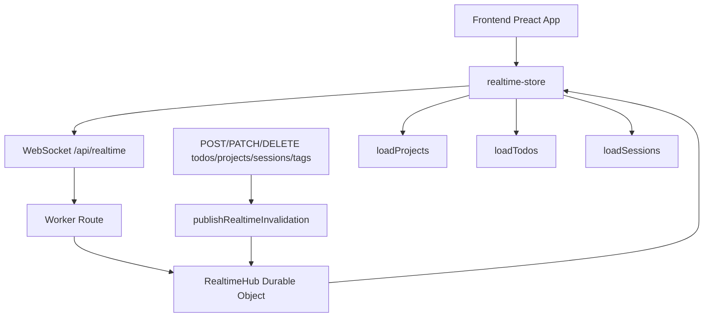
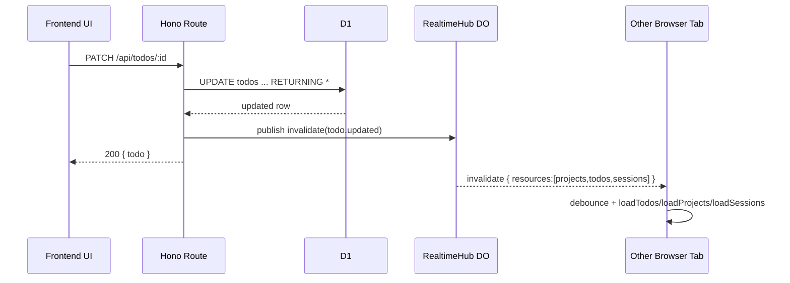

# feat: WebSocketでフロントエンドをリアルタイム同期

## Overview

Taskflow の frontend は初期ロード時に `loadProjects()` / `loadTodos()` / `loadSessions()` を実行し、その後は現在タブで行った操作しか反映されない。別タブ、別ブラウザ、CLI、将来の外部クライアントからデータが更新されても、画面は手動リロードまで古いままになる。

この計画では、**Cloudflare Durable Objects + WebSocket** を使ってサーバーから変更通知を配信し、frontend 側は既存 store の `load*` 関数で再取得する。**リアルタイム配信は「差分更新」ではなく「invalidation 通知」に限定**し、既存 REST API を source of truth として維持する。

## Problem Statement / Motivation

現在の構成では以下の問題がある。

- Project 詳細画面のタスク・セッション一覧が他クライアントの変更を反映しない
- MatrixView と ProjectDetailPage を複数タブで開くと状態がずれる
- CLI や将来の自動化ツールが REST API を更新しても frontend に即時反映されない
- `projects` 集計値、`sessions.task_total/task_completed`、linked task 表示など派生表示が stale になりやすい

特にこのアプリは `@preact/signals` の store を中心に UI を構成しており、state の単一ソースが frontend に寄りすぎると整合性が崩れやすい。リアルタイム化は UX 改善だけでなく、**複数クライアント間の state drift を抑えるための基盤整備**でもある。

## Research Summary

### Local Findings

- API は `src/index.ts` で REST ルートのみ登録しており、リアルタイム endpoint は存在しない
- Worker 設定 `wrangler.jsonc` には D1 binding のみで、Durable Object binding が未定義
- frontend のデータ取得は store 経由に統一されている
  - `frontend/src/stores/todo-store.ts:47-58`
  - `frontend/src/stores/project-store.ts:24-35`
  - `frontend/src/stores/session-store.ts:26-37`
- ProjectDetailPage は `projects.value` / `todos.value` / `sessions.value` を `useComputed()` で project 単位に絞り込む構成
  - `frontend/src/pages/ProjectDetailPage.tsx:33-47`
- institutional learnings では以下が重要
  - コンポーネント内では `signal()` / `computed()` を使わず `useSignal()` / `useComputed()` を使う
  - コンポーネントから `api.*` を直接呼ばず必ず store 経由にする
  - frontend 側で複雑な差分同期を持ち込むより、store を source of interaction に保つ

### External Findings

- Cloudflare では複数クライアントへの WebSocket 調停は Durable Objects が公式パターン
- Durable Objects の WebSocket Hibernation を使うとアイドル時の接続維持コストを抑えやすい
- Hono 単体でも upgrade は可能だが、複数 Worker インスタンス間の broadcast 調停は別途必要
- 今回の要件は server -> client の一方向通知が中心なので SSE も候補だが、ユーザー要求が WebSocket 指定であり、将来の双方向用途も見込めるため WebSocket を採用する

## Proposed Solution

### Chosen Approach

以下の 2 層構成を採用する。

1. backend に **Realtime Durable Object** を追加する
2. frontend に **realtime store / connection manager** を追加する

backend の mutation 完了後に、該当カテゴリの invalidation event を Durable Object に publish する。frontend はその event を受けて、関係する store の `load*` を debounce 付きで再実行する。

### なぜ差分パッチではなく invalidation か

- 既存 UI は REST response を前提にした store 更新ロジックで組まれている
- `projects` は集計値を含み、`sessions` は `task_total/task_completed` など派生列を返すため、差分再現ロジックを WebSocket payload 側に複製すると壊れやすい
- server で確定した最新状態を再取得した方が、linked task や集計値の整合性を保ちやすい
- optimistic update と echo event が競合しても、再取得なら idempotent に収束できる

## Technical Approach

### Architecture



### Event Contract

WebSocket で送る payload は最小限に絞る。

```json
{
  "type": "invalidate",
  "scope": "all",
  "resources": ["projects", "todos", "sessions"],
  "reason": "todo.updated",
  "project_id": "optional-project-id",
  "entity_id": "optional-entity-id",
  "occurred_at": "2026-03-06T12:34:56Z"
}
```

#### ルール

- `type` は当面 `invalidate` のみ
- `resources` は `projects` / `todos` / `sessions` / `session_logs` / `session_tasks`
- `reason` は `todo.created`, `todo.updated`, `session.deleted`, `session_log.created` など監査しやすい文字列
- payload に完全な entity snapshot は含めない
- client は `resources` を見て対応する store だけ再取得する

### Backend Changes

#### 1. Durable Object を追加

- `src/realtime/RealtimeHub.ts`
- `src/realtime/publish.ts`
- `src/types.ts` に Durable Object namespace binding 追加
- `wrangler.jsonc` に `durable_objects.bindings` と migration 追加

RealtimeHub の責務:

- WebSocket 接続受け入れ
- 接続ごとの購読メタデータ保持
- invalidation event の fan-out
- hibernation からの復元
- 将来の channel 拡張に備えた接続メタ保持

#### 2. Realtime 接続 endpoint を追加

- `src/routes/realtime.ts`
- `src/index.ts` で `/api/realtime` を route 追加

初期版は `scope=all` を標準にし、project 単位の絞り込みは event payload に `project_id` を含めるだけに留める。frontend store が現在全件ロード型のため、まずは全体 invalidation の方が実装が単純で事故が少ない。

#### 3. Publish helper を mutation ルートに差し込む

対象:

- `src/routes/todos.ts`
  - `POST /`
  - `PATCH /:id`
  - `PATCH /reorder`
  - `DELETE /:id`
  - tag link/unlink
  - todo sessions 関連で集計に影響する箇所
- `src/routes/sessions.ts`
  - `POST /`
  - `PATCH /:id`
  - `DELETE /:id`
  - session log create
  - session task link/unlink
- `src/routes/projects.ts`
  - create / update / delete / archive
- `src/routes/tags.ts`
  - create / update / delete

publish は **DB 更新成功後のみ** 実行する。publish 失敗時は API 自体を失敗させず、ログに残す。

#### 4. 認証方針

browser WebSocket API では既存の `Authorization: Bearer` header をそのまま流しにくいため、MVP では以下のどちらかに固定する。

- Option A: `?token=` クエリで既存 token を渡す
- Option B: 認証済み HTTP endpoint で短命 ticket を発行し、`?ticket=` で接続する

この計画では **Option A を MVP、Option B を将来改善** とする。理由はこのアプリが既に `VITE_API_TOKEN` を browser 側に持っており、追加複雑性を避けたいから。ただし URL ログ流出のリスクを plan に明記し、Worker 側で URL 全文をログ出力しないことを受け入れ条件に含める。

### Frontend Changes

#### 1. realtime store を追加

- `frontend/src/stores/realtime-store.ts`

責務:

- WebSocket 接続/切断
- 再接続（指数バックオフ、jitter 付き）
- 接続状態 signal 管理
- 受信 event の debounce / coalescing
- 対応 store の `load*` 呼び出し

公開する signal:

- `realtimeStatus`: `"idle" | "connecting" | "connected" | "disconnected" | "error"`
- `lastRealtimeEventAt`
- `lastRealtimeError`

#### 2. App 初期化で realtime を開始

- `frontend/src/app.tsx`

既存の `loadProjects/loadTodos/loadSessions/loadTags` 実行後に realtime 接続を開始する。初回ロード失敗時でも WebSocket 接続は可能だが、UI を壊さないために **初回ロード完了後** に開始する。

#### 3. invalidation 受信時の再取得ルール

```ts
// frontend/src/stores/realtime-store.ts
if (resources.has("projects")) queue(loadProjects);
if (resources.has("todos")) queue(loadTodos);
if (resources.has("sessions")) queue(loadSessions);
if (resources.has("session_logs") && currentOpenSessionId.value) {
  queue(() => loadSessionLogs(currentOpenSessionId.value));
}
if (resources.has("session_tasks") && currentOpenSessionId.value) {
  queue(() => loadLinkedTasks(currentOpenSessionId.value));
}
```

ポイント:

- burst 更新時に API を連打しないよう、100-300ms 程度の debounce を入れる
- 同一 tick では resource 単位で 1 回にまとめる
- store アクション内の optimistic update は維持し、WebSocket は最終整合性の回収に使う

## Alternative Approaches Considered

### 1. SSE を使う

メリット:

- server -> client 一方向通知には十分
- 実装が比較的軽い

見送り理由:

- ユーザー要求が WebSocket 指定
- 将来的に presence や ack を入れたくなった場合に拡張しづらい
- Cloudflare 公式のリアルタイム調停パターンとして Durable Objects + WebSockets が強い

### 2. WebSocket payload で store を直接 patch する

メリット:

- 再取得が減る

見送り理由:

- `projects` 集計、`sessions.task_total/task_completed`、linked task など派生状態の整合性維持が難しい
- REST のビジネスルールを二重実装しやすい
- 既存 store 規約と institutional learnings に反する

### 3. 定期 polling のみで対応する

メリット:

- 実装最小

見送り理由:

- 画面更新が遅い
- 不要な API コールが増える
- リアルタイム要件を満たしづらい

## System-Wide Impact

### Interaction Graph



- todo 更新は project 集計や session 進捗にも影響しうるため、`todos` だけでなく `projects` / `sessions` invalidation も必要
- session task link/unlink は `session_tasks` と `sessions` の両方へ波及する
- session log create は `session_logs` と `sessions.updated_at` の両方に影響する

### Error & Failure Propagation

- WebSocket 接続失敗
  - UI は通常動作を継続
  - `realtimeStatus = error/disconnected`
  - retry で自動復旧
- publish 失敗
  - mutation API は成功のまま返す
  - server log に記録
  - 他タブは次回 reconnect / manual refresh まで遅延反映
- load* 再取得失敗
  - 既存 store の `error` signal に乗る
  - 次イベントまたは次 retry で回復可能

### State Lifecycle Risks

- optimistic update 後に echo invalidation が返る
  - 再取得で server state に収束させる
- 複数イベントの burst
  - debounce 未導入だと `loadTodos/loadProjects/loadSessions` が多重発火する
- session detail を閉じた後に `session_logs` event が届く
  - open session id がない場合は無視する
- reconnect 後の missed events
  - 接続再開時に `loadProjects/loadTodos/loadSessions` を一度フル同期する

### API Surface Parity

リアルタイム publish を漏らすと同期抜けが起きるため、以下は同時に洗い出す。

- todo CRUD
- todo reorder
- todo tag link/unlink
- session CRUD
- session log create
- session task link/unlink
- project CRUD / archive
- tag CRUD

### Integration Test Scenarios

- 別タブで todo を完了したら、開いている ProjectDetailPage の SummaryCards と TasksSection が自動更新される
- session task を link/unlink したら、SessionInlineDetail の linked task 表示と session 進捗が別タブでも更新される
- WebSocket 切断中に複数変更が発生しても、reconnect 後のフル同期で収束する
- burst で 10 件更新しても store 再取得回数が resource ごとに coalesce される
- publish 失敗時でも mutation API 自体は 200/201 を返す

## SpecFlow Analysis

### User Flow Overview

1. ユーザー A が UI で todo / session / project を更新する
2. backend が DB commit 後に invalidation を publish する
3. 同じデータを見ているユーザー B の frontend が event を受信する
4. frontend store が対象 resource を再取得する
5. `ProjectDetailPage` / `MatrixView` / `SessionInlineDetail` が signals 経由で再描画される

### Gaps Identified

- **Critical**: WebSocket 認証方法が未定だと接続できない
- **Critical**: どの mutation がどの resource を invalidate するか一覧化しないと同期漏れが出る
- **Important**: session detail をどの store/state で「現在開いているセッション」として持つか未整理
- **Important**: reconnect 時に missed events をどう補償するかを決める必要がある
- **Important**: リアルタイム接続状態を UI に表示するか未定
- **Nice-to-have**: project 単位 subscription 最適化は初期版では不要だが、将来のスケール観点でメモしておく

### Resolution in This Plan

- 認証は MVP で query token、将来 ticket 化
- mutation -> invalidation mapping 表を実装タスクに含める
- reconnect 時フル同期を acceptance criteria に含める
- UI 表示は必須ではないが、debug しやすくするため status signal は持つ

## Implementation Phases

### Phase 1: Realtime 基盤追加

- [ ] `wrangler.jsonc` に Durable Object binding/migration を追加
- [ ] `src/types.ts` に `REALTIME_HUB` binding を追加
- [ ] `src/realtime/RealtimeHub.ts` を作成
- [ ] `src/routes/realtime.ts` を作成
- [ ] `src/index.ts` で `/api/realtime` を登録
- [ ] WebSocket 接続・切断・broadcast の最小テストを追加

成果物:

- `src/realtime/RealtimeHub.ts`
- `src/realtime/publish.ts`
- `src/routes/realtime.ts`
- `src/types.ts`
- `wrangler.jsonc`

### Phase 2: Mutation Publish の全面適用

- [ ] todo CRUD / reorder / tag link の publish helper 組み込み
- [ ] session CRUD / log / task link/unlink の publish helper 組み込み
- [ ] project CRUD の publish helper 組み込み
- [ ] tag CRUD の publish helper 組み込み
- [ ] mutation -> invalidation mapping 表をコードコメントまたは plan に沿って明示

成果物:

- `src/routes/todos.ts`
- `src/routes/sessions.ts`
- `src/routes/projects.ts`
- `src/routes/tags.ts`

### Phase 3: Frontend 受信・再同期

- [ ] `frontend/src/stores/realtime-store.ts` を追加
- [ ] `frontend/src/app.tsx` で初期化を追加
- [ ] reconnect / debounce / burst coalescing を実装
- [ ] session detail 向けの `currentOpenSessionId` 管理を整理
- [ ] 必要なら connection status の小さな UI 表示を追加

成果物:

- `frontend/src/stores/realtime-store.ts`
- `frontend/src/app.tsx`
- `frontend/src/stores/session-store.ts`
- `frontend/src/components/*`（必要な場合のみ）

## Acceptance Criteria

### Functional Requirements

- [ ] backend に `/api/realtime` WebSocket endpoint が追加される
- [ ] todo / project / session / session log / session task の変更が、別タブの frontend に 1 秒以内で反映される
- [ ] frontend は WebSocket event を受けて store 経由で再取得し、コンポーネントから `api.*` を直接呼ばない
- [ ] reconnect 後に missed events があっても full sync で整合性が回復する
- [ ] publish 失敗が mutation API の成功レスポンスを壊さない

### Non-Functional Requirements

- [ ] 連続イベント時に resource ごとの再取得が debounce/coalesce される
- [ ] idle 接続は Durable Object WebSocket Hibernation 前提で保持する
- [ ] URL/token の全文をサーバーログに残さない
- [ ] realtime 無効時でも既存アプリが通常利用できる

### Quality Gates

- [ ] backend test: publish helper / realtime route / mutation 後 event 送出を検証
- [ ] frontend test or manual verification: 2 タブ同期、disconnect/reconnect、burst 更新
- [ ] `npm test`, `npm run typecheck`, `cd frontend && npm run build` を通す

## Success Metrics

- 別タブ更新の UI 反映遅延が通常 1 秒未満
- 同一 burst 内で `loadProjects/loadTodos/loadSessions` の多重呼び出しが抑制される
- 手動リロードなしで stale view が解消される
- 実装後も store 経由ルールと Signals ルールを破らない

## Dependencies & Risks

### Dependencies

- Cloudflare Durable Objects binding の追加
- WebSocket 認証方式の合意
- frontend 側で app 起動時に realtime を初期化する導線

### Risks

- mutation publish 漏れによる部分的な同期抜け
- query token 利用時のログ/URL 露出リスク
- reconnect ループで API を叩きすぎるリスク
- session logs / linked tasks の再取得対象管理が曖昧だと不要 fetch が増える

### Mitigations

- mutation -> invalidation mapping をレビュー可能な形で一覧化
- reconnect 成功時の full sync で missed event を回収
- exponential backoff + cap を導入
- 初期版は payload を単純化し、diff patch を持ち込まない

## MVP

### `src/realtime/RealtimeHub.ts`

```ts
export class RealtimeHub extends DurableObject {
  async fetch(request: Request): Promise<Response> {
    // WebSocket 受け入れ
    // 接続メタを serializeAttachment に保存
    // broadcast 用の接続集合を管理
  }
}
```

### `src/realtime/publish.ts`

```ts
export async function publishRealtimeInvalidation(env: AppEnv["Bindings"], event: RealtimeInvalidationEvent) {
  // Durable Object stub を取得して broadcast
  // 失敗しても throw せずログだけ残す
}
```

### `frontend/src/stores/realtime-store.ts`

```ts
export function connectRealtime() {
  // WebSocket 接続
  // onmessage で resources を見て load* を queue
  // onclose で backoff retry
}
```

## Sources & References

### Internal References

- `src/index.ts:11-24` - 現在は REST route のみ
- `wrangler.jsonc:1-20` - D1 binding のみで Durable Object 未設定
- `frontend/src/stores/todo-store.ts:47-58` - TODO 一括再取得の既存パターン
- `frontend/src/stores/project-store.ts:24-35` - Project 一括再取得の既存パターン
- `frontend/src/stores/session-store.ts:26-37` - Session 一括再取得の既存パターン
- `frontend/src/pages/ProjectDetailPage.tsx:33-47` - store 全件から project 単位に絞り込む構造
- `docs/solutions/ui-bugs/preact-signal-misuse-and-code-review-fixes.md` - Signals API 誤用防止
- `docs/solutions/logic-errors/preact-signals-store-architecture-code-review-findings.md` - store 経由ルールと data integrity

### External References

- Cloudflare Docs: Durable Objects WebSocket Best Practices
  - https://developers.cloudflare.com/durable-objects/best-practices/websockets/
- Cloudflare Docs: WebSocket Hibernation API
  - https://developers.cloudflare.com/durable-objects/best-practices/websockets/#websocket-hibernation-api
- Cloudflare Docs: Workers WebSockets
  - https://developers.cloudflare.com/workers/examples/websockets/
- Cloudflare Docs: Server-Sent Events
  - https://developers.cloudflare.com/workers/runtime-apis/streams/server-sent-events/
- Hono Docs: WebSocket Helper
  - https://hono.dev/docs/helpers/websocket
- Preact Docs: Signals
  - https://preactjs.com/guide/v10/signals/

## Open Questions

- session logs と linked tasks を初期版の realtime 対象に含めるか、それとも CRUD 基本系（projects/todos/sessions）のみに絞るか
- realtime 接続状態を UI 上に明示するか、開発者向け state のみ持つか
- 将来 CLI が REST を介さず DB を直接更新するケースを許容するか

現時点では、**初期版は projects / todos / sessions を必須対象、session logs / session tasks は同一フェーズで含めるが、UI 表示は最小限**が妥当。
