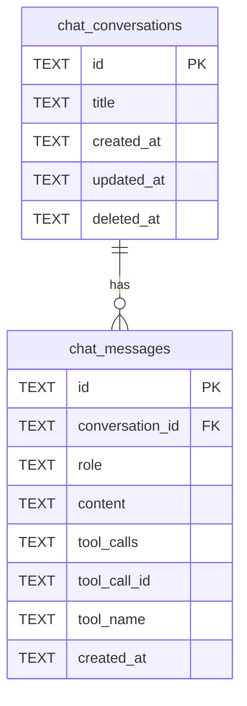

# feat: エージェントチャット機能を追加

## Overview

Taskflowフロントエンドに右サイドパネル型のチャットUIを追加し、自然言語でタスク操作を行えるエージェント機能を実装する。ローカルのcmuxブリッジサーバー（Bun, port 19876）を拡張し、**`@mariozechner/pi-ai`**（pi-mono）を使用してOpenRouter経由のLLM呼び出し + Tool Use（Function Calling）でTaskflow APIを自律的に操作する。

### pi-ai 採用理由

- OpenRouter含む20+プロバイダー対応、プロバイダー切替が容易
- Tool Use + ストリーミングが組み込み済み（agent loop自前実装不要）
- `tool_call` イベントでツール実行前インターセプト可能（破壊的操作の確認に最適）
- TypeBoxスキーマでツール定義（Zodと類似の体験）
- `maxSteps` でTool Useループ上限を簡単に設定

## Architecture

```
┌─────────────────────────────────────────────────────────┐
│ Frontend (Preact SPA)                                   │
│  ┌──────────────┐  ┌─────────────────────────────────┐  │
│  │ Main View    │  │ Chat Panel (right side)         │  │
│  │ (Matrix/     │  │  - message list                 │  │
│  │  Project)    │  │  - input box                    │  │
│  │              │  │  - tool execution indicators    │  │
│  │              │  │  - confirm dialogs              │  │
│  └──────────────┘  └──────────┬──────────────────────┘  │
└─────────────────────────────────┼───────────────────────┘
                                  │ SSE (per-message)
                                  ▼
┌─────────────────────────────────────────────────────────┐
│ Bridge Server (Bun, localhost:19876)                     │
│  POST /chat  → SSE response                             │
│  ┌──────────────────────────────────────────────────┐   │
│  │ pi-ai Agent:                                     │   │
│  │  1. getModel("openrouter/...") で LLM取得        │   │
│  │  2. stream() with tools → ストリーミング応答     │   │
│  │  3. tool_call event → インターセプト（確認）     │   │
│  │  4. execute() → Taskflow API呼出               │   │
│  │  5. maxSteps で自動ループ制御                    │   │
│  └──────────────────────────────────────────────────┘   │
└──────────┬──────────────────────────┬───────────────────┘
           │                          │
           ▼                          ▼
┌────────────────────┐   ┌────────────────────────────┐
│ OpenRouter API     │   │ Taskflow Workers API       │
│ (LLM + Tool Use)  │   │ - Tool execution (CRUD)    │
│                    │   │ - Chat history CRUD        │
└────────────────────┘   └────────────────────────────┘
```

## Technical Approach

### Implementation Phases

#### Phase 1: 基盤 -- D1スキーマ + Workers APIルート + ブリッジ基本チャット

最小限のエンドツーエンドを動かす。Tool Useなし、ストリーミングなしでまず疎通。

**1-1. D1マイグレーション** (`migrations/0007_create_chat.sql`)

```sql
-- チャット会話テーブル
CREATE TABLE IF NOT EXISTS chat_conversations (
    id TEXT PRIMARY KEY DEFAULT (lower(hex(randomblob(16)))),
    title TEXT CHECK(length(title) <= 200),
    created_at TEXT NOT NULL DEFAULT (strftime('%Y-%m-%dT%H:%M:%SZ', 'now')),
    updated_at TEXT NOT NULL DEFAULT (strftime('%Y-%m-%dT%H:%M:%SZ', 'now')),
    deleted_at TEXT
);

CREATE INDEX IF NOT EXISTS idx_chat_conversations_created
    ON chat_conversations(created_at DESC);

-- チャットメッセージテーブル
CREATE TABLE IF NOT EXISTS chat_messages (
    id TEXT PRIMARY KEY DEFAULT (lower(hex(randomblob(16)))),
    conversation_id TEXT NOT NULL,
    role TEXT NOT NULL CHECK(role IN ('user', 'assistant', 'system', 'tool')),
    content TEXT,
    tool_calls TEXT,      -- JSON: OpenRouter tool_calls array
    tool_call_id TEXT,    -- tool結果の場合、対応するtool_call ID
    tool_name TEXT,       -- tool結果の場合、ツール名
    created_at TEXT NOT NULL DEFAULT (strftime('%Y-%m-%dT%H:%M:%SZ', 'now'))
);

CREATE INDEX IF NOT EXISTS idx_chat_messages_conversation
    ON chat_messages(conversation_id, created_at);
```



**1-2. Workers API: チャット履歴ルート** (`src/routes/chat.ts`)

既存のルートパターン（`sessions.ts`参照）に準拠:

```typescript
// src/routes/chat.ts
import { Hono } from "hono";
import type { AppEnv } from "../types";

const app = new Hono<AppEnv>();

// 会話一覧
// GET /api/chat/conversations
// → { items: Conversation[], meta: { total, limit, offset } }

// 会話作成
// POST /api/chat/conversations
// → 201 { conversation: { id, title, created_at } }

// 会話削除（論理削除）
// DELETE /api/chat/conversations/:id

// メッセージ一覧（会話内）
// GET /api/chat/conversations/:id/messages
// → { items: Message[], meta: { total, limit, offset } }

// メッセージ追加（ユーザー/アシスタント/tool）
// POST /api/chat/conversations/:id/messages
// body: { role, content, tool_calls?, tool_call_id?, tool_name? }
// → 201 { message: Message }

export default app;
```

`src/index.ts` にマウント: `app.route("/api/chat", chat)`

バリデーション: `src/validators/chat.ts` にZodスキーマ追加

**1-3. ブリッジサーバー: 基本チャットエンドポイント** (`taskflow-cmux-server.ts`)

```typescript
// POST /chat
// Request body: { message: string, conversation_id?: string, context?: ViewContext }
// Response: text/event-stream (SSE)
//
// SSE events:
//   event: token      data: { content: "..." }
//   event: tool_call  data: { tool_call_id, tool_name, args }
//   event: tool_result data: { tool_call_id, result }
//   event: confirm    data: { tool_call_id, tool_name, args, description }
//   event: done       data: { conversation_id: "...", message_id: "..." }
//   event: error      data: { message: "..." }
```

**pi-ai によるLLM呼び出し:**

```typescript
import { getModel } from "@mariozechner/pi-ai";
import { Type } from "@sinclair/typebox";

// OpenRouter経由でモデル取得
const model = getModel(`openrouter/${chatModel}`);

// ストリーミング + Tool Use
const response = await model.stream({
  messages: [...history, { role: "user", content: userMessage }],
  system: systemPrompt,
  tools: agentTools,  // TypeBoxスキーマで定義
});

// イベントベースでSSEに転送
for await (const event of response) {
  if (event.type === "text_delta") {
    sseWrite({ event: "token", data: { content: event.text } });
  } else if (event.type === "toolcall_end") {
    // Tool実行 → 結果をSSEで送信
  }
}
```

設定（`~/.taskflow-cmux/config.json`、既存パターン踏襲）:
- `openrouter_api_key`: OpenRouter APIキー
- `chat_model`: 使用モデル（デフォルト: `anthropic/claude-sonnet-4`）
- `api_token`: Taskflow APIトークン
- `api_url`: Taskflow API URL（デフォルト: `https://taskflow.kenji-draemon.workers.dev`）

**1-4. フロントエンド: 最小チャットUI**

- `frontend/src/components/ChatPanel.tsx` -- 右サイドパネル
- `frontend/src/stores/chat-store.ts` -- signals: `messages`, `isOpen`, `conversationId`, `isStreaming`
- `frontend/src/lib/bridge.ts` に `bridgeChat()` 関数追加（SSE受信）
- トグルボタンを既存ヘッダーに追加
- パネル幅: 400px固定、デフォルト閉

ファイル一覧:
- `migrations/0007_create_chat.sql`
- `src/routes/chat.ts`
- `src/validators/chat.ts`
- `src/index.ts` (マウント追加)
- `taskflow-cmux-server.ts` (POST /chat 追加)
- `frontend/src/components/ChatPanel.tsx`
- `frontend/src/stores/chat-store.ts`
- `frontend/src/lib/bridge.ts` (bridgeChat追加)
- `frontend/src/styles/global.css` (チャットパネルCSS)
- `frontend/src/app.tsx` (パネル統合)

---

#### Phase 2: Tool Use -- LLMにTaskflow API操作を実行させる

**2-1. Tool定義** (`agent-tools.ts`)

pi-aiの `registerTool` + TypeBoxスキーマで定義:

| Tool名 | 対応API | 説明 |
|---------|---------|------|
| `list_todos` | GET /api/todos | タスク一覧取得（フィルタ付き） |
| `get_todo` | GET /api/todos/:id | タスク詳細取得 |
| `create_todo` | POST /api/todos | タスク作成 |
| `update_todo` | PATCH /api/todos/:id | タスク更新 |
| `delete_todo` | DELETE /api/todos/:id | タスク削除（要確認） |
| `list_projects` | GET /api/projects | プロジェクト一覧 |
| `get_project` | GET /api/projects/:id | プロジェクト詳細 |
| `create_project` | POST /api/projects | プロジェクト作成 |
| `update_project` | PATCH /api/projects/:id | プロジェクト更新 |
| `delete_project` | DELETE /api/projects/:id | プロジェクト削除（要確認） |
| `list_sessions` | GET /api/sessions | セッション一覧 |
| `create_session` | POST /api/sessions | セッション作成 |
| `update_session` | PATCH /api/sessions/:id | セッション更新 |
| `delete_session` | DELETE /api/sessions/:id | セッション削除（要確認） |
| `list_tags` | GET /api/tags | タグ一覧 |
| `create_tag` | POST /api/tags | タグ作成 |
| `get_todays_todos` | GET /api/todos/today | 今日のタスク取得 |

```typescript
// agent-tools.ts (例)
import { Type } from "@sinclair/typebox";

export const tools = [
  {
    name: "list_todos",
    description: "タスク一覧を取得。status, project_id, tag等でフィルタ可能",
    parameters: Type.Object({
      status: Type.Optional(Type.String({ description: "pending | in_progress | completed" })),
      project_id: Type.Optional(Type.String()),
      tag: Type.Optional(Type.String()),
    }),
  },
  {
    name: "create_todo",
    description: "新しいタスクを作成",
    parameters: Type.Object({
      title: Type.String({ description: "タスクのタイトル" }),
      description: Type.Optional(Type.String()),
      priority: Type.Optional(Type.String({ description: "high | medium | low" })),
      project_id: Type.Optional(Type.String()),
      due_date: Type.Optional(Type.String({ description: "ISO 8601 date" })),
    }),
  },
  // ... 他のツールも同様
];
```

**2-2. pi-aiの `tool_call` イベントで破壊的操作を制御**

pi-aiのイベントシステムを使い、`delete_*` ツール呼び出し時にクライアント確認を挟む:

```typescript
// tool_call イベントでインターセプト
model.on("tool_call", async (event, ctx) => {
  if (event.toolName.startsWith("delete_")) {
    // SSEで確認イベントを送信
    sseWrite({ event: "confirm", data: {
      tool_call_id: event.toolCallId,
      tool_name: event.toolName,
      args: event.input,
      description: `${event.toolName} を実行しますか？`,
    }});
    // クライアントの応答を待つ
    const approved = await waitForConfirmation(event.toolCallId);
    if (!approved) return { block: true };
  }
});
```

確認エンドポイント: `POST /chat/confirm`
- Bridge Server側で `Map<string, PromiseResolver>` を管理
- クライアントが `{ tool_call_id, approved }` を送信 → Promiseをresolve

**2-4. フロントエンド: Tool実行UI**

- ツール実行中インジケーター（「タスクを作成中...」）
- 確認ダイアログコンポーネント
- ツール結果の表示（操作ログとして会話内に表示）

ファイル一覧:
- `agent-tools.ts` (Tool定義)
- `taskflow-cmux-server.ts` (Tool実行エンジン + confirm endpoint)
- `frontend/src/components/ChatPanel.tsx` (確認ダイアログ統合)
- `frontend/src/components/ChatConfirmDialog.tsx`
- `frontend/src/stores/chat-store.ts` (confirm状態管理追加)

---

#### Phase 3: ストリーミング強化 + コンテキスト連携

**3-1. SSEストリーミング実装**

pi-aiの `stream()` が返すイベントをSSEに変換:
- `text_delta` → SSE `event: token`
- `toolcall_start/end` → SSE `event: tool_call` / `event: tool_result`
- `thinking_delta` → （オプション）思考プロセス表示

フロントエンド:
- `fetch` + `ReadableStream` でSSE受信（POSTリクエストのため `EventSource` は不可）
- メッセージのリアルタイムレンダリング
- 「停止」ボタンでSSE接続を切断（AbortController）

**3-2. ビューコンテキスト連携**

フロントエンドからBridge Serverに渡すコンテキスト:

```typescript
interface ViewContext {
  currentPage: "matrix" | "project-detail";
  activeProjectId?: string;
  activeProjectName?: string;
  activeFilters?: {
    status?: string;
    tags?: string[];
  };
}
```

System Promptに埋め込み:
```
あなたはTaskflowのタスク管理アシスタントです。

現在のユーザーの画面状態:
- ページ: プロジェクト詳細
- プロジェクト: "Web開発" (id: abc123)
- フィルタ: ステータス=pending, タグ=["frontend"]

ユーザーが「タスクを追加して」と言った場合、特に指定がなければ
このプロジェクトにタスクを追加してください。
```

**3-3. Agent操作後のUI更新**

Bridge ServerがTaskflow APIを呼ぶ際、`X-Client-Id` ヘッダーを付けない（or Bridge専用ID）。
→ 既存のrealtime WebSocketが操作を検知し、フロントエンドのストアが自動更新される。

加えて、チャットストアでTool実行完了時に明示的にストアを再読み込み（即時反映のため）。

ファイル一覧:
- `taskflow-cmux-server.ts` (streaming対応)
- `frontend/src/components/ChatPanel.tsx` (ストリーミング表示, 停止ボタン)
- `frontend/src/stores/chat-store.ts` (コンテキスト収集, ストア再読込)

---

## Acceptance Criteria

### Functional Requirements

- [x] 右サイドパネルでチャットUIが開閉できる
- [x] 自然言語メッセージを送信し、LLMから応答を受け取れる
- [x] LLMがTool Useで全リソース（Todo, Project, Session, Tag）のCRUD操作を実行できる
- [x] 削除操作は確認ダイアログが表示される
- [x] 応答がSSEでストリーミング表示される
- [x] 停止ボタンでストリーミングを中断できる
- [ ] チャット履歴がD1に保存され、ページリロード後も復元される
- [x] 「新しい会話」で会話をリセットできる
- [x] 現在のビューコンテキストがLLMに渡される（基盤はあり、フロント側でcontext送信を追加すれば完了）
- [x] Agent操作の結果がメインビューに即座に反映される

### Non-Functional Requirements

- [ ] SSEストリーミングのレイテンシがユーザー体感で許容範囲（最初のトークンまで3秒以内）
- [ ] Bridge Serverの追加エンドポイントが既存cmux機能を破壊しない
- [ ] OpenRouter APIキーがフロントエンドに露出しない

## Dependencies & Prerequisites

- `@mariozechner/pi-ai` + `@sinclair/typebox` をブリッジサーバーの依存に追加
- OpenRouterアカウント + APIキー（既存）
- `~/.taskflow-cmux/config.json` に `chat_model` 設定を追加
- D1マイグレーション実行（`wrangler d1 migrations apply`）

## Risk Analysis & Mitigation

| リスク | 影響 | 緩和策 |
|--------|------|--------|
| OpenRouter API遅延/障害 | チャット不能 | タイムアウト60秒、エラーメッセージ表示 |
| Tool Useのループ（LLMが無限にToolを呼ぶ） | API過負荷 | pi-aiの `maxSteps: 10` で制御 |
| 破壊的操作の誤実行 | データ損失 | 確認ダイアログ + 論理削除で復元可能 |
| トークン消費量の増大 | コスト増 | コンテキストは最小限、会話履歴のウィンドウ制限（直近20メッセージ） |

## References

### Internal

- `taskflow-cmux-server.ts` -- ブリッジサーバー（拡張対象）
- `prompt-generator.ts` -- OpenRouter呼び出しパターン
- `src/routes/sessions.ts` -- CRUDルートパターン
- `frontend/src/stores/session-store.ts` -- ストアパターン
- `frontend/src/lib/bridge.ts` -- ブリッジクライアント
- `frontend/src/stores/realtime-store.ts` -- リアルタイム更新パターン

### External

- [`@mariozechner/pi-ai`](https://github.com/badlogic/pi-mono) -- マルチプロバイダーLLM API + Tool Use + ストリーミング

### Brainstorm

- `docs/brainstorms/2026-03-08-agent-chat-brainstorm.md`
